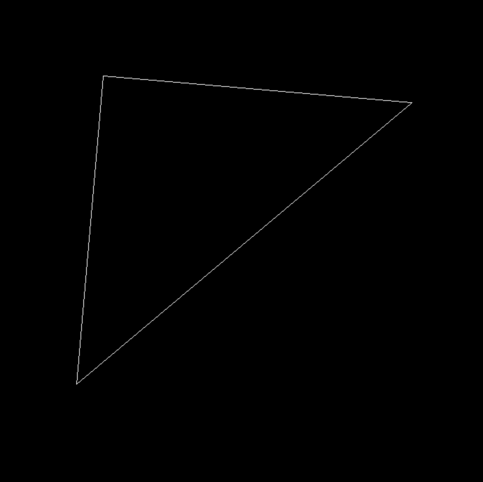
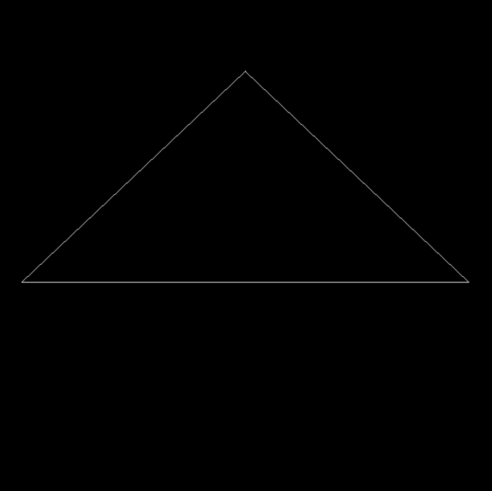
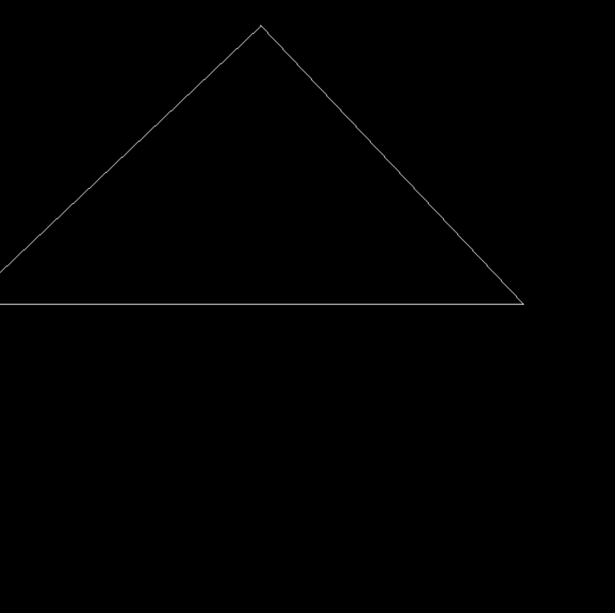

# GAMES101
This is an archive for homework in course GAMES101.
## Developing Environment
- Hardware
  - Device: MacBook Pro 2021 14''
  - CPU: M1 Pro (8 cores)
  - System: macOS Ventura 13.1
- Software
  - Homebrew: v3.6.18
  - CMake: v3.25.1
  - OpenCV: v4.7.0
  - Eigen: v3.40_1

<details id=1>
<summary><h2>Homework 1</h2></summary>

### Commands
```bash
./Rasterizer                    #Rotating around z-axis (by default)

./Rasterizer -x                 #Rotating around x-axis

./Rasterizer -y                 #Rotating around y-axis

./Rasterizer -r 20              #Rotating the triangle around z-axis by 20 degree
                                #save it to output.png

./Rasterizer -r 20 image.png    #Rotating the triangle around z-axis by 20 degree
                                #save it to image.png

./Rasterizer -r 20 -x image.png #Rotating the triangle around x-axis by 20 degree
                                #save it to image.png
```
### Basic
Rotating around z-axis


### Advance
Rotating around x-axis


Rotating around y-axis


</details>