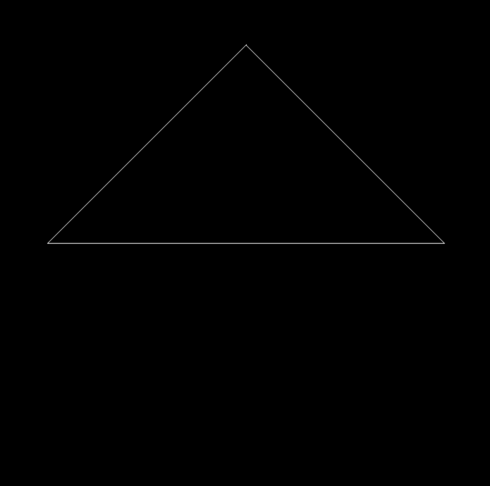

# GAMES101
This is an archive for homework in course GAMES101.

<table width=50%>
    <tr align="center">
        <th colspan="2">Hardware</th>
    </tr>
    <tr align="center">
        <td>Device</td>
        <td>MacBook Pro 2021 14''</td>
    </tr>
    <tr align="center">
        <td>CPU</td>
        <td>M1 Pro (8 cores)</td>
    </tr>
    <tr align="center">
        <td>System</td>
        <td>macOS Ventura 13.1</td>
    </tr>
</table>

<table width=50%>
    <tr align="center">
        <th colspan="2">Software</th>
    </tr>
    <tr align="center">
        <td>Homebrew</td>
        <td>v3.6.18</td>
    </tr>
    <tr align="center">
        <td>CMake</td>
        <td>v3.25.1</td>
    </tr>
    <tr align="center">
        <td>OpenCV</td>
        <td>v4.7.0</td>
    </tr>
    <tr align="center">
        <td>Eigen</td>
        <td>v3.40_1</td>
    </tr>
</table>

<details id=1>
<summary><h2>Homework 1</h2></summary>

### Running command
```bash
./Rasterizer                    #Rotating around z-axis (by default)

./Rasterizer -x                 #Rotating around x-axis

./Rasterizer -y                 #Rotating around y-axis

./Rasterizer -r 20              #Rotating the triangle around z-axis by 20 degree
                                #save it to output.png

./Rasterizer -r 20 image.png    #Rotating the triangle around z-axis by 20 degree
                                #save it to image.png

./Rasterizer -r 20 -x image.png #Rotating the triangle around x-axis by 20 degree
                                #save it to image.png
```
### Basic
Rotating around z-axis


### Advance
Rotating around x-axis


Rotating around y-axis


</details>